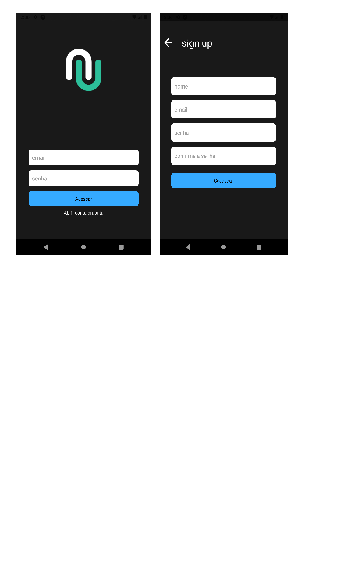

<p align="center">
  
</p>

# 🛠 resources useds
 - Node.Js - [DOWNLOAD HERE](https://nodejs.org/en/)
 - EXPO - [DOCS](https://docs.expo.io/)
 - Javascript (React native)

 ### Installation
   ```
   cd "C:\Users\NomeDoComputador\Documents\..."
   ```

  after, when in the project folder , type it in cmd :

   `$ npm install`

  Automatically install all necessary dependencies:

- `node_modules` -  contain the packages.

### Running this application 

well, now in the same screen (app.js) , just start the project with an emulator .
